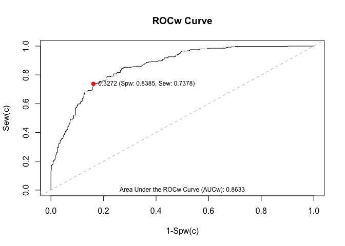

<!-- README.md is generated from README.Rmd. Please edit that file -->

# svyROC

The goal of the svyROC package is to plot weighted estimates of the ROC
curves and to obtain weighted estimates of the AUC.

The following functions are available:

- `wse`, `wsp`: estimate sensitivity and specificity parameters for a
  specific cut-off point considering sampling weights.
- `wroc`: estimate the ROC curve considering sampling weights.
- `wauc`: estimate the AUC considering sampling weights.
- `corrected.wauc`: correct the optimism of the weighted estimate of the
  AUC by means of replicate weights.
- `wocp`: calculate optimal cut-off points for individual classification
  considering sampling weights.
- `wroc.plot`: plot the ROC curve.

The methodology proposed for the above-mentioned functions can be found
in the following **references**:

- Iparragirre, A., Barrio, I., Aramendi, J. and Arostegui, I. (2022).
  Estimation of cut-off points under complex-sampling design data.
  *SORT-Statistics and Operations Research Transactions* **46**(1),
  137–158.

- Iparragirre, A., Barrio, I. and Arostegui, I. (2023). Estimation of
  the ROC curve and the area under it with complex survey data. *Stat*
  **12**(1), e635.

- Iparragirre, A. and Barrio, I. (2024). Optimism Correction of the AUC
  with Complex Survey Data. In: Einbeck, J., Maeng, H., Ogundimu, E.,
  Perrakis, K. (eds) Developments in Statistical Modelling. IWSM 2024.
  Contributions to Statistics. Springer, Cham.

## Installation

To install the package from CRAN:

``` r
install.packages("svyROC")
```

To install the most updated version of the package from GitHub run the
following code:

``` r
devtools::install_github("aiparragirre/svyROC")
```

## Example

We need information on three elements for each unit in the sample in
order to estimate the ROC curve (`wroc()` function) and AUC (`wauc()`
function):

- `response.var`: variable indicating the dichotomous response variable.
- `phat.var`: predicted probabilities of event.
- `weights.var`: variable indicating the sampling weights.

We can put these three vectors in a data frame, or save them separately
in three different vectors. The data set `example_data_wroc` is set as
an example in the package. We also need to define the tags for events
and non-events.

``` r
library(svyROC)
data(example_data_wroc)

mycurve <- wroc(response.var = "y", phat.var = "phat", weights.var = "weights",
                data = example_data_wroc,
                tag.event = 1, tag.nonevent = 0)

# Or equivalently
mycurve <- wroc(response.var = example_data_wroc$y,
                phat.var = example_data_wroc$phat,
                weights.var = example_data_wroc$weights,
                tag.event = 1, tag.nonevent = 0)
```

Similarly, we can run the following code to estimate the AUC:

``` r
auc.obj <- wauc(response.var = "y",
                phat.var = "phat",
                weights.var = "weights",
                tag.event = 1,
                tag.nonevent = 0,
                data = example_data_wroc)

# Or equivalently
auc.obj <- wauc(response.var = example_data_wroc$y,
                phat.var = example_data_wroc$phat,
                weights.var = example_data_wroc$weights,
                tag.event = 1, tag.nonevent = 0)
```

We can correct the optimism of the weighted estimate of the AUC by means
of replicate weights, as proposed in Iparragirre and Barrio (2024), by
means of the `corrected.wauc()` function. For this purpose, we
additionally need information on the covariates and the sampling design.
Here is an example of the usage of this function:

``` r

data(example_variables_wroc)
mydesign <- survey::svydesign(ids = ~cluster, strata = ~strata,
                              weights = ~weights, nest = TRUE,
                              data = example_variables_wroc)
m <- survey::svyglm(y ~ x1 + x2 + x3 + x4 + x5 + x6, design = mydesign,
                    family = quasibinomial())
phat <- predict(m, newdata = example_variables_wroc, type = "response")
myaucw <- wauc(response.var = example_variables_wroc$y, phat.var = phat,
               weights.var = example_variables_wroc$weights)

# Correction of the AUCw:
set.seed(1)
cor <- corrected.wauc(data = example_variables_wroc,
                      formula = y ~ x1 + x2 + x3 + x4 + x5 + x6,
                      tag.event = 1, tag.nonevent = 0,
                      weights.var = "weights", strata.var = "strata", cluster.var = "cluster",
                      method = "dCV", dCV.method = "pooling", k = 10, R = 20)
# Or equivalently:
set.seed(1)
cor <- corrected.wauc(design = mydesign,
                      formula = y ~ x1 + x2 + x3 + x4 + x5 + x6,
                      tag.event = 1, tag.nonevent = 0,
                      method = "dCV", dCV.method = "pooling", k = 10, R = 20)
```

We can also estimate the sensitivity (`wse()`) and specificity (`wsp()`)
parameters for a specific cut-off point considering sampling weights.
For this purpose, we need to indicate the cut-off point we want to use
in the function by means of the argument `cutoff.value`:

``` r

# Specificity ----------------------------------------------------------

sp.obj <- wsp(response.var = "y",
              phat.var = "phat",
              weights.var = "weights",
              tag.nonevent = 0,
              cutoff.value = 0.5,
              data = example_data_wroc)

# Or equivalently
sp.obj <- wsp(response.var = example_data_wroc$y,
              phat.var = example_data_wroc$phat,
              weights.var = example_data_wroc$weights,
              tag.nonevent = 0,
              cutoff.value = 0.5)
   
# Sensitivity ----------------------------------------------------------

se.obj <- wse(response.var = "y",
              phat.var = "phat",
              weights.var = "weights",
              tag.event = 1,
              cutoff.value = 0.5,
              data = example_data_wroc)

# Or equivalently
se.obj <- wse(response.var = example_data_wroc$y,
              phat.var = example_data_wroc$phat,
              weights.var = example_data_wroc$weights,
              tag.event = 1,
              cutoff.value = 0.5)
```

Finally, use the function `wocp()` to obtain optimal cut-off points for
individual classification as proposed in Iparragirre et al (2022). Some
functions of the package `OptimalCutpoints` have been modified in order
for them to consider sampling weights:

Lopez-Raton, M., Rodriguez-Alvarez, M.X, Cadarso-Suarez, C. and
Gude-Sampedro, F. (2014). OptimalCutpoints: An R Package for Selecting
Optimal Cutpoints in Diagnostic Tests. *Journal of Statistical Software*
**61**(8), 1–36.

One of the methods proposed in the paper needs to be selected when
running the function by means of the argument `method`: `Youden`,
`MaxProdSpSe`, `ROC01` or `MaxEfficiency`.

``` r
myocp <- wocp(response.var = "y",
              phat.var = "phat", weights.var = "weights",
              tag.event = 1,
              tag.nonevent = 0,
              method = "Youden",
              data = example_data_wroc)

# Or equivalently
myocp <- wocp(example_data_wroc$y,
              example_data_wroc$phat,
              example_data_wroc$weights,
              tag.event = 1,
              tag.nonevent = 0,
              method = "Youden")
```

If you want to draw the optimal cut-off point in the ROC curve, then use
the function `wroc.plot()` and indicate the method by means of the
argument `cutoff.method` in the function `wroc()` as follows:

``` r
mycurve <- wroc(response.var = "y",
                phat.var = "phat",
                weights.var = "weights",
                data = example_data_wroc,
                tag.event = 1,
                tag.nonevent = 0,
                cutoff.method = "Youden")
wroc.plot(x = mycurve,
          print.auc = TRUE,
          print.cutoff = TRUE)
```


